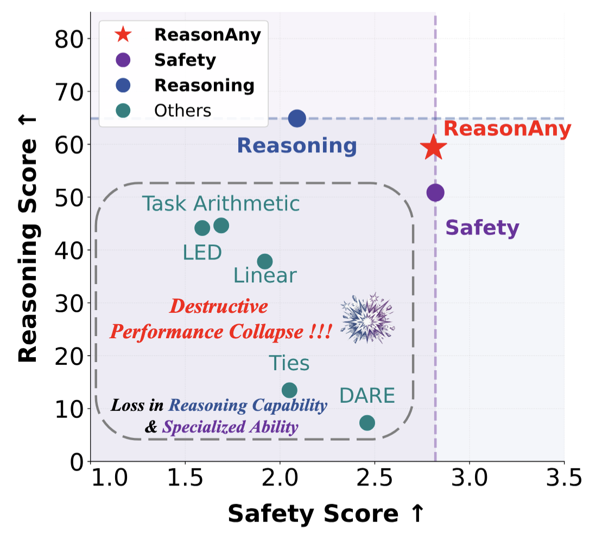
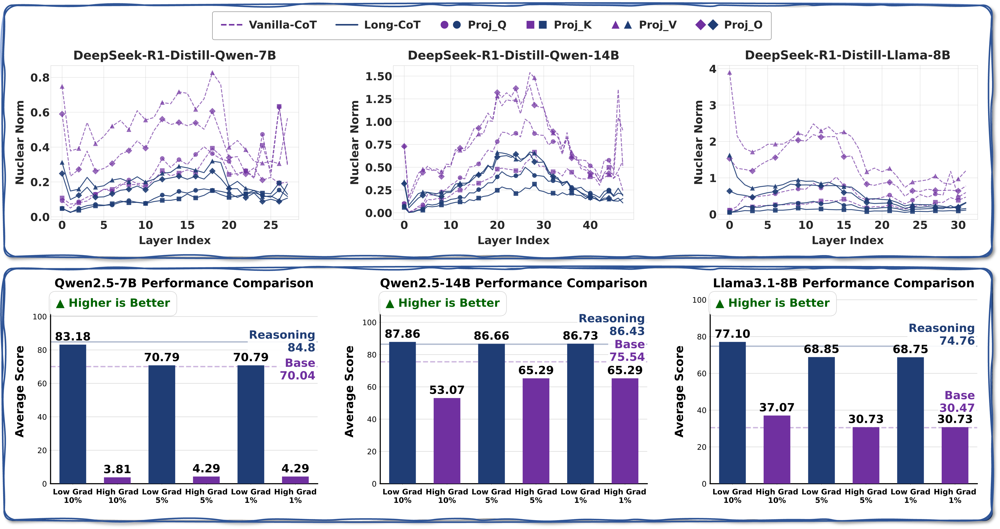
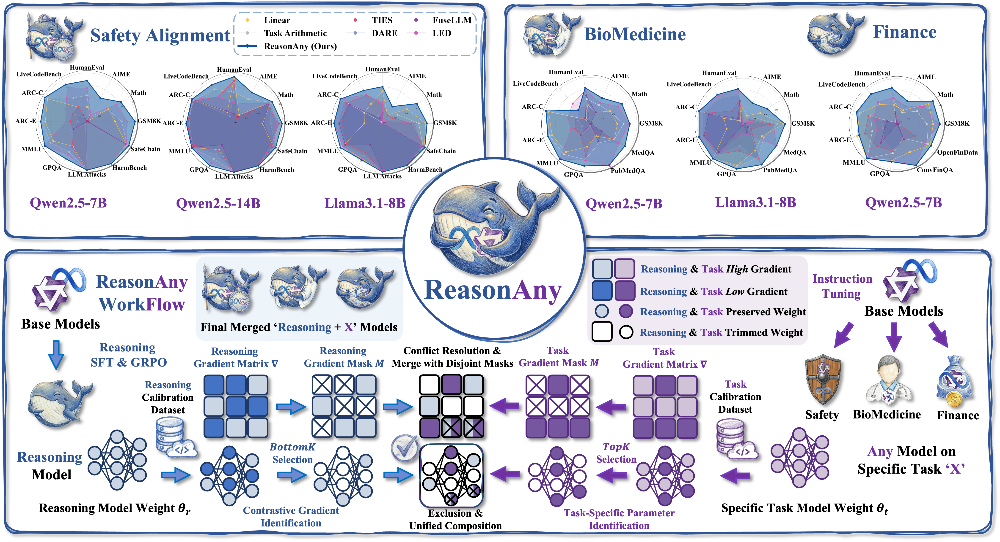
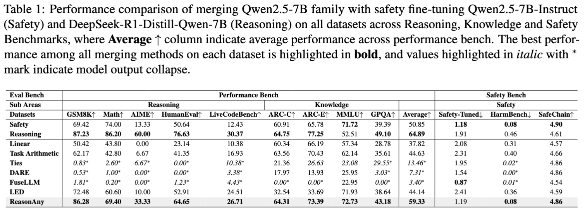
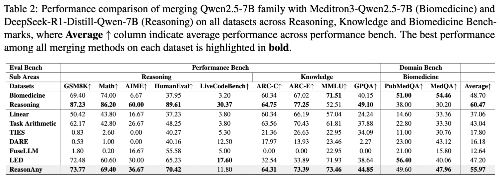
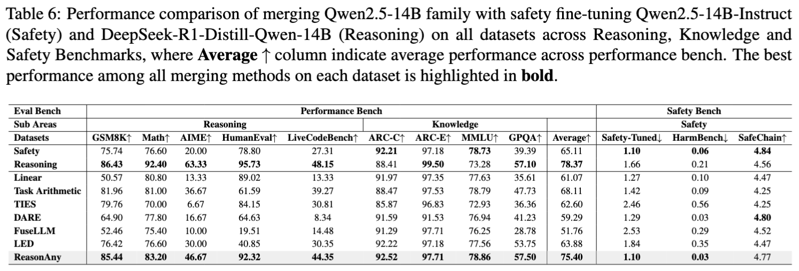
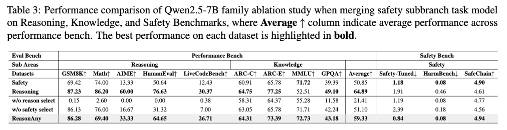

<div align="center">
  <h1>ReasonAny: Incorporating Reasoning Capability to Any Model via Simple and Effective Model Merging</h1>
  <br />
  <span style="color:red">📢 <strong><i>If you are interested in our work, please star ⭐ our project.</i></strong></span>

  <h4>
    <a href="https://arxiv.org/abs/2601.05560"></a>
    
    
  </h4>
</div>

## 📖 Abstract

**ReasonAny** is a novel model merging framework that resolves the "Reasoning + X" conflict. We identify a counter-intuitive phenomenon: reasoning ability predominantly resides in parameter regions with **low gradient sensitivity**, while domain capabilities often correspond to high-magnitude parameters. Motivated by this, ReasonAny employs **Contrastive Gradient Identification** to synthesize reasoning capabilities with domain-specific models (Safety, Biomedicine, Finance) without the destructive performance collapse observed in existing methods.

## 📉 Motivation: Overcoming Performance Collapse

<div align="center">
  
  </div>

**Figure 1: Destructive Performance Collapse in Baselines.**
As illustrated above, existing merging methods (Task Arithmetic, LED, TIES, DARE) fail to balance capabilities, typically suffering from a significant loss in reasoning capability or severe compromise in domain-specific utility. **ReasonAny** (red star) is the only method that resides in the top-right corner, achieving high scores in both Safety and Reasoning simultaneously.

## 💡 Key Insight: The "Low-Gradient" Phenomenon

<div align="center">
  
  </div>

**Figure 2: Gradient Nuclear Norm Analysis.**
Our spectral analysis reveals a counter-intuitive phenomenon: models with long Chain-of-Thought (Long-CoT) capabilities (e.g., DeepSeek-R1-Distill) exhibit significantly **lower nuclear norms** in their gradient matrices compared to standard instruction-tuned models (Top row). 

The additive experiments (Bottom row) validate this: merging only the **lowest 10%, 5%, or 1%** of gradient parameters allows the model to recover GSM8K performance (e.g., 83.18 score), whereas merging high-gradient parameters leads to performance collapse.

## 🌈 Methodology

<div align="center">
  
  </div>


**Figure 3: Experimental Results and Workflow of ReasonAny**. Experimental results on **Safety** (**top-left**), **Biomedicine**, and **Finance** (**top-right**) benchmarks demonstrate ReasonAny, shown in light blue background, significantly outperforming baselines. **ReasonAny Workflow** (**bottom**) employs **Contrastive Gradient Identification** (**bottom-right**) to isolate low-gradient reasoning and high-gradient task weights and **Exclusion** (**bottom-middle**) step disjoint masks that merge specialized capabilities without compromising reasoning capabilities.

## 🚩 Main Results

We evaluate **ReasonAny against 10 state-of-the-art baselines across Safety, Biomedicine, and Finance domains using Qwen2.5 (7B, 14B, 32B, QwQ-32B) and Llama 3.1-8B model families**. **Across 9 model configurations and 15+ benchmarks**, we conducted **over 1,000 evaluation experiments** to verify the framework's effectiveness and robustness across diverse scales and specialized fields.

### 1. Safety Alignment (Qwen2.5-7B)

<div align="center">
  
  </div>

**Table 1:** ReasonAny achieves a GSM8K score of **86.28**, recovering **98.91%** of the reasoning capability compared to the expert. Simultaneously, it maintains a Safety Score of 1.19 (lower is better for LLM-Attack), statistically indistinguishable from the Safety expert, whereas baselines like Task Arithmetic drift significantly.

### 2. Biomedicine Domain (Qwen2.5-7B)

<div align="center">
  
  </div>

**Table 2:** In the biomedical domain, ReasonAny effectively balances capabilities. It retains substantial domain expertise with a **MedQA score of 47.96** while preserving logical acuity (GSM8K score of 73.77), significantly outperforming baselines like TIES and FuseLLM which suffer from catastrophic collapse.

### 3. Advanced Safety (Qwen2.5-14B)

<div align="center">
  
  </div>

**Table 6:** ReasonAny demonstrates superior scalability on the 14B model. It achieves **85.44 on GSM8K**, recovering 98.85% of reasoning performance, and matches the Safety expert perfectly on the LLM Attacks benchmark (1.10), proving its robustness across model sizes.

## 🔍 Ablation Study

<div align="center">
  
  </div>

**Table 3: Ablation Analysis.**
We investigated the contribution of each component:
* **w/o Reasoning Selection:** Removing the low-gradient reasoning selection causes a catastrophic collapse in reasoning (GSM8K drops to **0.15**).
* **w/o Safety Selection:** Excluding high-gradient safety parameters compromises alignment, increasing the Harmfulness score to **2.39**.
* **ReasonAny:** Synthesizing both strategies maintains high reasoning (86.28) and low harmfulness (0.84), confirming that distinct handling of parameter regions is essential.

## 🚀 Quick Start

### 🔧 Requirements

The following packages are required to run the code:

- python==3.10
- pytorch==2.7.0
- transformers==4.40.0
- datasets==2.18.0

### 🌟 Usage

**1. Install Dependencies**

```bash
conda create -n reasonany python=3.10 -y
conda activate reasonany
pip install -r requirements.txt
```


**2. Run Experiments**

### Model Merging
```bash
cd ReasonAny
```
#### Safety Model
```bash
cd safety
bash run_safety.sh
```

#### Biomedicine Model
```bash
cd biomedicine
bash run_bio.sh
```

#### Finance Model
```bash
cd finance
bash run_finance.sh
```

## 📝 License

Distributed under the Apache-2.0 License. See LICENSE for more information.

## Acknowledgements

Some code in this project is adapted from resources provided by the following repositories:

* https://github.com/llm-attacks/llm-attacks
* https://github.com/OpenSafetyLab/SALAD-BENCH
* https://github.com/arcee-ai/mergekit
* https://github.com/MqLeet/LED-Merging
* https://github.com/vinid/safety-tuned-llamas
* https://github.com/open-compass/opencompass

We greatly appreciate the contributions of the original authors.

## 📖 BibTeX

```bibtex
@article{yang2026reasonany,
  title={ReasonAny: Incorporating Reasoning Capability to Any Model via Simple and Effective Model Merging}, 
  author={Junyao Yang and Chen Qian and Dongrui Liu and Wen Shen and Yong Liu and Jing Shao},
  journal={arXiv preprint arXiv:2601.05560},
  year={2026},
  url={[https://arxiv.org/abs/2601.05560](https://arxiv.org/abs/2601.05560)}
}
```
